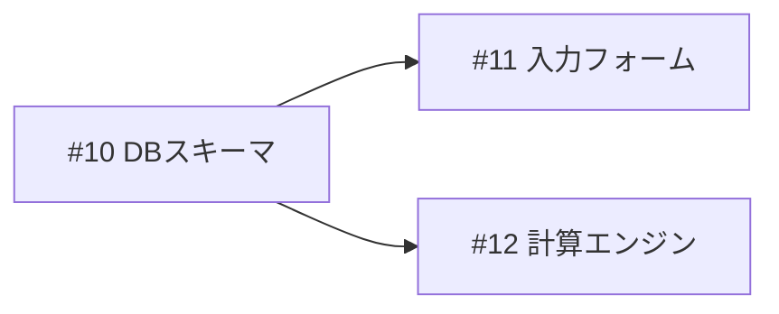

# create-issues

箇条書きの要件を、仕様を明確にした上で「1 issue = 1 PR」単位のGitHub Issueに落とし込むワークフロー。

このskillの成果物は**issueのみ**。コードは書かず、実装にも着手しない。実装は `implement-issue`(1件)や `orchestrate-project`(並列)が、ここで作ったissueを入力として引き継ぐ。だからissue本文は「この会話を読んでいない実装者が、本文だけで実装を完了できる」情報量にする必要がある。

## 手順

### 1. 文脈の把握

要件を受け取ったら、質問する前にまずリポジトリから読み取れることを読み取る。ユーザーへの質問は「リポジトリを読んでも分からないこと」に絞るためで、調べれば分かることを聞くのはユーザーの時間の無駄になる。

- SPEC.md や README、関連する既存コードを読み、要件がどこに関わるか把握する
- 既存のopen issueを確認し、重複や依存関係の候補を探す:

```bash
gh issue list --state open --json number,title,body --limit 100
```

既存issueと重複する要件は新規作成せず、その旨をユーザーに伝える。既存issueが土台になるなら「依存issue」として張る。

### 2. 仕様の明確化

要件の各項目について、issueに落とすのに十分な解像度があるか点検する。不明点は**推測で埋めずにユーザーに質問する**。曖昧なままissue化すると、実装者(サブエージェントや将来の自分)が誤った解釈で実装し、手戻りがPR単位で発生するため。

質問する価値があるのは、**答えによってissueの分割・やること・完了条件が変わる**もの:

- 要件同士が矛盾している、または解釈が複数ある
- スコープの境界が不明(例: 「グラフ表示」は既存画面への追加か新規画面か)
- 完了条件を検証可能な形で書けない(例: 「速くする」→ 何がどうなれば完了か)
- 技術選定が分かれ、どちらを選ぶかで作業量や依存が変わる

逆に、リポジトリの規約から自明なこと、どちらでも結果が変わらない些末なことは聞かない。質問はまとめて一度に行い、選択肢を提示できるものは提示する(AskUserQuestionが使えるなら使う)。

回答を得たら、確定した仕様を要件に反映してから次へ進む。

### 3. 1PR単位への分解・統合

確定した仕様を、レビュー可能な1PR単位のissueに再編成する。要件の箇条書きとissueは1対1にならないことが多い。**分解**と**統合**の両方向で調整する:

- **分解する**: 1項目が複数の独立した機能・レイヤーにまたがる場合(例: 「入力フォームと計算エンジンとグラフ」)。土台になるセットアップ系(スキーマ定義、共通コンポーネント)は機能とは別issueに切り出す。
- **統合する**: 複数項目が同じファイル群への小さな変更で、別PRにするとレビューが細切れになる場合。1つのissueの「やること」に列挙する。
- **依存は最小限かつ正直に。** 本当に土台が必要なものだけ「依存issue」に書く。依存が少ないほど並列実装できる。
- **ファイル競合も依存として扱う。** 論理的に独立でも、同じファイルを大きく書き換える2つのissueを並列実装するとコンフリクトで両方が停滞する。片方に依存を張って直列化するか、共通部分を先行issueに切り出す。
- **各issueは自己完結に書く。** 実装者はこの会話を読めない。ファイルパス、既存コードとの関係、確定した仕様上の決定事項を本文に含める。

### 4. issueの作成

分解が決まったら、承認を待たずにそのままissueを作成してよい(ユーザーの方針)。仕様の質疑(手順2)が実質的な合意形成になっている。

**依存されている側から順に**(トポロジカル順で)作成する。先に作ったissueの番号が確定してから、依存する側の本文に番号を書けるようにするため。

本文は次の4項目で構成する。`implement-issue` / `orchestrate-project` skillがこの形式を読み取る:

```markdown
## 目的
<なぜこのissueが必要か。要件のどの部分に対応するか>

## 依存issue
- #<番号>(なければ「なし」)

## やること
- <実装内容。ファイルパスや対象箇所を具体的に>
- <ここに列挙したものがスコープのすべて。実装者は列挙外に手を出さない>

## 完了条件
- [ ] <検証可能な受け入れ基準>
- [ ] <ビルド・lint・テストが通る等、検証コマンドがあれば明記>
```

```bash
gh issue create --title "<タイトル>" --body "<本文>"
```

タイトルはissueの主題を簡潔に(例: `投資枠入力フォームに取得価額欄を追加`)。

### 5. 報告

作成が終わったら、番号つきの一覧と依存グラフをユーザーに報告する:



あわせて「依存がないため今すぐ着手できるissue」を明示する。実装まで求められたら、単一なら `implement-issue`、複数並列なら `orchestrate-project` に引き継ぐ。

## 例外時の振る舞い

- **要件が1issueに収まる規模だった場合**: 無理に分割しない。1件だけ作成して報告する。
- **質疑の途中で要件自体が変わった場合**: 変わった前提で分解をやり直す。作成済みissueがあれば `gh issue edit` で追随させるか、不要になったものはクローズ提案する。
- **リポジトリに要件と矛盾する既存実装を見つけた場合**: issue化を止めて先にユーザーへ報告する(矛盾を抱えたままissueを量産しない)。
