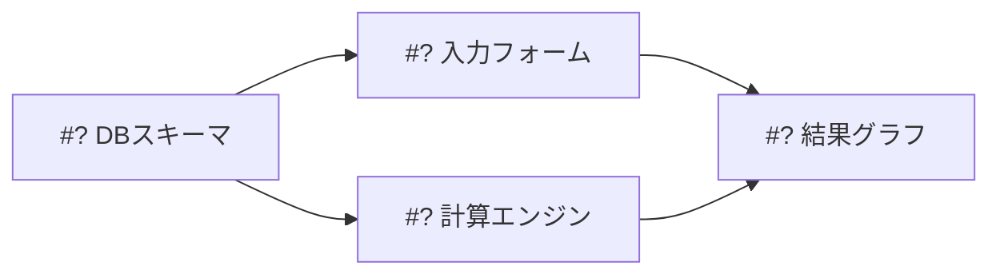

# orchestrate-project

要件を「1 issue = 1 PR」単位のチケット群に分解し、依存関係を管理しながらサブエージェントに並列実装させるオーケストレータ。

役割分担は次の通り:

- **オーケストレータ(このskillを実行するあなた)**: 分解・issue作成・依存管理・サブエージェントの起動と監視・進捗報告。**自分ではコードを書かない。**
- **サブエージェント**: `implement-issue` skill に従って1チケットを実装し、PRを作成する。
- **ユーザー**: PRのレビューとマージ。マージが依存解消のトリガーになる。

## 状態管理の原則: GitHubが唯一の真実

オーケストレーションの状態(どのチケットが完了/実装中/待機か)は、会話のメモリではなく**GitHubから再構築する**。issueのopen/closed、PRの有無とマージ状態がすべて。こうしておくと、セッションが切れても・ユーザーが手動でissueを操作しても、`gh`で現状を取得すれば正しく再開できる。

- チケット = GitHub Issue(本文の「依存issue」に #N を記載)
- 完了 = 対応PRがマージされ、`Closes #N` でissueがクローズされた状態
- 実装中 = openなissueに対しopenなPRが存在する状態

途中参加・再開時はまずこれを実行して盤面を把握する:

```bash
gh issue list --state all --json number,title,state,body --limit 100
gh pr list --state all --json number,title,state,headRefName --limit 100
```

## フェーズ1: 要件の分解

要件ソース(ユーザーの指示、SPEC.md、既存issue)を読み、チケットに分解する。

### 分解の指針

- **粒度は機能単位**(例: F-01 基本情報入力フォーム、F-06 シミュレーションエンジン)。1チケット = 1機能 = 1PR。セットアップ系(スキーマ定義、共通コンポーネント)は機能とは別チケットに切り出す。
- **依存は最小限かつ正直に。** 本当に土台が必要なものだけ依存にする。依存が少ないほど並列度が上がる。
- **ファイル競合も依存として扱う。** 論理的には独立でも、同じファイルを大きく書き換える2チケットを並列実行するとマージコンフリクトで両方が停滞する。その場合は片方に依存を張って直列化するか、共通部分を先行チケットに切り出す。
- **各チケットは自己完結に書く。** サブエージェントはこの会話を読めない。issue本文だけで実装できる情報量にする。

### 分解計画の提示と承認

issue作成は外部への書き込みなので、**作成前に必ず分解計画をユーザーに提示して承認を得る**。提示には依存グラフを含める:



各チケットの概要(タイトル・スコープ・依存)を一覧で添える。ユーザーが粒度や依存に注文をつけたら計画を修正して再提示する。

## フェーズ2: GitHub Issue の作成

承認後、**依存されている側から順に**(トポロジカル順で)issueを作成する。先に作ったissueの番号が確定してから、依存する側の本文に「依存: #N」を書けるようにするため。

本文は `implement-issue` / `create-issues` skill と共通の形式に合わせる:

```markdown
## 目的
<なぜこのチケットが必要か。要件のどの部分に対応するか>

## 依存issue
- #<番号>(なければ「なし」)

## やること
- <実装内容。ファイルパスや対象箇所を具体的に>
- <ここに列挙したものがスコープのすべて。実装者は列挙外に手を出さない>

## 完了条件
- [ ] <検証可能な受け入れ基準>
- [ ] <ビルド・lint・テストが通る 等の検証コマンドも明記>
```

```bash
gh issue create --title "<タイトル>" --body "<本文>"
```

作成後、番号つきの一覧と依存グラフ(番号確定版)をユーザーに報告する。

## フェーズ3: 並列実装の実行ループ

### 着手可能(Ready)の判定

チケットがReadyなのは、**依存するissueがすべてクローズ済み(=依存PRがマージ済み)** のとき。マージ前の依存ブランチに積むことはしない(依存PRへのレビュー修正でrebase地獄になるため)。

### サブエージェントの起動

Readyなチケットそれぞれに対し、サブエージェント(general-purpose)を**同一ターンで並列に**起動する。

サブエージェントへのプロンプトは自己完結させる:

```
リポジトリ /Users/ishizawa/work/repos/money-plan で GitHub Issue #<番号> を実装してください。

手順は .claude/skills/implement-issue/SKILL.md に従うこと。まずこのファイルを読んでください。
要点: origin/main から feature/<番号> ブランチを git worktree(../money-plan-worktrees/<番号>)に
切り、issueのスコープと完了条件に沿って実装し、自己検証(ビルド・lint・テスト)を通してから
push して PR を作成する(本文に Closes #<番号> を含める)。

完了したら PR の URL と、自己検証の結果(通った項目・通らなかった項目)を報告してください。
```

worktree分離は `implement-issue` 側の手順で行われるため、Agentツールのworktree isolationは使わない(二重になる)。

### 完了の受け取りと検収

サブエージェントの完了報告を受けたら、鵜呑みにせず確認する:

```bash
gh pr view <PR番号> --json state,statusCheckRollup,title
```

- PRが実在し、CIが通っていれば「レビュー待ち」としてユーザーに報告する。
- サブエージェントが失敗した(PRが無い、テストが通らない)場合は、失敗理由を添えて**1回だけ**再起動する。プロンプトに前回の失敗内容と対処方針を追記する。2回失敗したらそのチケットは保留にし、ユーザーに判断を仰ぐ。

### 指摘への対応はサブエージェントに委譲する

ユーザーからPRに対する指摘があった場合や、GitHubのイベント(PRレビューコメント・CIの失敗・issueへのコメント等)経由で指摘が来た場合は、**オーケストレータ自身が修正せず、そのissueを実装したサブエージェントに対応を委譲する**。実装したサブエージェントがそのブランチ・worktree・実装意図のコンテキストを持っているため、修正が最も速く正確に済む。

- 実装時に起動したサブエージェントが継続可能なら、`SendMessage` で指摘内容(該当PR番号・指摘の全文・対処方針)を渡して修正・再pushさせる。
- コンテキストが失われている場合は、`implement-issue` の手順に沿って新たにサブエージェントを起動し、対象PRのブランチをチェックアウトして指摘に対応させる。プロンプトには「どのPRか」「指摘の全文」「変更してよい範囲」を自己完結で記載する。
- 修正完了後は検収と同様に `gh pr view` でCI・反映を確認してからユーザーに報告する。

### マージ待ちとwaveの進行

マージはユーザーが行う。実行中のサブエージェントがすべて完了し、残りが「レビュー待ち」と「依存待ち」だけになったら、進捗表を提示してターンを終える:

```markdown
## 進捗
| チケット | 状態 | PR |
|---|---|---|
| #2 DBスキーマ | ✅ マージ済み | #10 |
| #3 入力フォーム | 👀 レビュー待ち | #11 |
| #4 計算エンジン | 🔨 実装中 | - |
| #5 結果グラフ | ⏸ 依存待ち (#3, #4) | - |
```

「マージしたら教えてください。#3 がマージされると #5 に着手できます」のように、**次に何がアンブロックされるか**を添える。ユーザーから「マージした」「続けて」と言われたら、GitHubから状態を再取得してReadyになったチケットを起動する。これを全チケット完了まで繰り返す。

## 失敗・例外時の振る舞い

- **要件の矛盾・不明点を分解中に見つけたら**: 推測でチケット化せず、フェーズ1の計画提示時に「要確認事項」として明示する。
- **実装中に分解の誤りが発覚したら**(スコープ過大、依存の見落とし): issueを `gh issue edit` で修正するか分割し、依存グラフの更新をユーザーに報告する。
- **ユーザーがPRをクローズ(リジェクト)したら**: そのチケットは自動で再着手しない。方針を確認してからやり直す。
