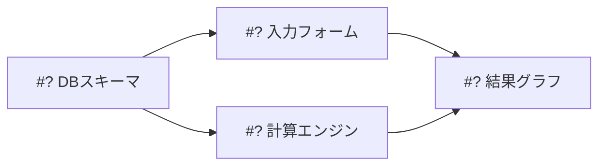

# orchestrate-project

要件を「1 issue = 1 PR」単位のチケット群に分解し、依存関係を管理しながらサブエージェントに並列実装させるオーケストレータ。

役割分担は次の通り:

- **オーケストレータ(このskillを実行するあなた)**: 分解・issue作成・依存管理・サブエージェントの起動と監視・進捗報告。**自分ではコードを書かない。**
- **サブエージェント**: `implement-issue` skill に従って1チケットを実装し、PRを作成する。
- **ユーザー**: PRのレビューとマージ。

**依存解消のトリガーは「マージ」ではなく「依存PRの作成」。** 依存チケットのPRができたら、その依存ブランチから派生して後続チケットに着手する(stacked PR)。ユーザーのレビュー待ちで実装が止まらないようにするため。

## 状態管理の原則: GitHubが唯一の真実

オーケストレーションの状態(どのチケットが完了/実装中/待機か)は、会話のメモリではなく**GitHubから再構築する**。issueのopen/closed、PRの有無とマージ状態がすべて。こうしておくと、セッションが切れても・ユーザーが手動でissueを操作しても、`gh`で現状を取得すれば正しく再開できる。

- チケット = GitHub Issue(本文の「依存issue」に #N を記載)
- 完了 = 対応PRがマージされ、`Closes #N` でissueがクローズされた状態
- 実装中 = openなissueに対しopenなPRが存在する状態
- issueとPRの対応づけ = PR本文の `Closes #N`
- stack構造 = PRの `baseRefName`(`main` 以外なら、そのブランチのPRの上に積まれている)

途中参加・再開時はまずこれを実行して盤面を把握する:

```bash
gh issue list --state all --json number,title,state,body --limit 100
gh pr list --state all --json number,title,state,headRefName,baseRefName,body --limit 100
```

PRの `headRefName` / `baseRefName` / `body` が揃えば、「どのチケットがどのブランチで実装され、どのブランチの上に積まれているか」を会話メモリなしで復元できる。

## フェーズ1: 要件の分解

要件ソース(ユーザーの指示、SPEC.md、既存issue)を読み、チケットに分解する。

### 分解の指針

- **粒度は機能単位**(例: F-01 基本情報入力フォーム、F-06 シミュレーションエンジン)。1チケット = 1機能 = 1PR。セットアップ系(スキーマ定義、共通コンポーネント)は機能とは別チケットに切り出す。
- **依存は最小限かつ正直に。** 本当に土台が必要なものだけ依存にする。依存が少ないほど並列度が上がる。
- **依存は1チケットにつき1つを目指す。** 依存が1つならその依存PRの作成を待つだけでstackして着手できるが、2つ以上あると全依存のマージ待ちになり直列化する(フェーズ3参照)。依存が2つになりそうなら、土台部分を先行チケットにまとめて依存を1本化できないか検討する。
- **ファイル競合も依存として扱う。** 論理的には独立でも、同じファイルを大きく書き換える2チケットを並列実行するとマージコンフリクトで両方が停滞する。その場合は片方に依存を張って直列化するか、共通部分を先行チケットに切り出す。
- **各チケットは自己完結に書く。** サブエージェントはこの会話を読めない。issue本文だけで実装できる情報量にする。

### 分解計画の提示と承認

issue作成は外部への書き込みなので、**作成前に必ず分解計画をユーザーに提示して承認を得る**。提示には依存グラフを含める:



各チケットの概要(タイトル・スコープ・依存)を一覧で添える。ユーザーが粒度や依存に注文をつけたら計画を修正して再提示する。

## フェーズ2: GitHub Issue の作成

承認後、**依存されている側から順に**(トポロジカル順で)issueを作成する。先に作ったissueの番号が確定してから、依存する側の本文に「依存: #N」を書けるようにするため。

本文は `implement-issue` / `create-issues` skill と共通の形式に合わせる:

```markdown
## 目的
<なぜこのチケットが必要か。要件のどの部分に対応するか>

## 依存issue
- #<番号>(なければ「なし」)

## やること
- <実装内容。ファイルパスや対象箇所を具体的に>
- <ここに列挙したものがスコープのすべて。実装者は列挙外に手を出さない>

## 完了条件
- [ ] <検証可能な受け入れ基準>
- [ ] <ビルド・lint・テストが通る 等の検証コマンドも明記>
```

```bash
gh issue create --title "<タイトル>" --body "<本文>"
```

作成後、番号つきの一覧と依存グラフ(番号確定版)をユーザーに報告する。

## フェーズ3: 並列実装の実行ループ

### 着手可能(Ready)の判定

**依存PRのマージは待たない。** 依存チケットのPRが作成された時点で、その依存ブランチから派生して着手する(stacked PR)。マージ待ちで直列化すると、レビュー滞留がそのまま全体の停止時間になるため。

判定は依存の数で分岐する:

| 依存の数 | 依存の状態 | 判定 | 派生元 / PRのbase |
|---|---|---|---|
| 0 | - | Ready | `origin/main` / `main` |
| 1 | マージ済み(issueクローズ) | Ready | `origin/main` / `main` |
| 1 | openなPRあり | **Ready(stacked)** | 依存PRの`headRefName` / 同ブランチ |
| 1 | PR未作成 | 待機 | - |
| 2以上 | 全依存がマージ済み | Ready | `origin/main` / `main` |
| 2以上 | 1つでも未マージ | 待機 | - |

**依存が2つ以上のチケットはstackしない。** baseブランチは1つしか指定できず、無理に統合するとコンフリクトの温床になる。全依存のマージを待って`main`から着手する。分解時(フェーズ1)に依存を1つに抑えられるなら、その方が並列度は上がる。

依存チェーン(A←B←C)は多段stackになる。3段を超えるstackは依存PRの修正が下流全体に波及して不安定なので、そうなりそうなら分解の見直しをユーザーに提案する。

依存PRのブランチ名はGitHubから取得する:

```bash
gh pr list --state open --json number,headRefName,body --limit 100
```

`Closes #<依存番号>` を本文に含むPRが、その依存チケットのPR。その `headRefName` が派生元になる。

### サブエージェントの起動

Readyなチケットそれぞれに対し、サブエージェント(general-purpose)を**同一ターンで並列に**起動する。

プロンプトは自己完結させ、**派生元ブランチとPRのbaseを明示する**(implement-issueのデフォルトは`main`派生なので、stackする場合は上書き指定が必須):

依存なし、または依存がマージ済みの場合:

```
リポジトリ /Users/ishizawa/work/repos/money-plan で GitHub Issue #<番号> を実装してください。

手順は .claude/skills/implement-issue/SKILL.md に従うこと。まずこのファイルを読んでください。
要点: origin/main から feature/<番号> ブランチを git worktree(../money-plan-worktrees/<番号>)に
切り、issueのスコープと完了条件に沿って実装し、自己検証(ビルド・lint・テスト)を通してから
push して PR を作成する(--base main、本文に Closes #<番号> を含める)。

完了したら PR の URL と、自己検証の結果(通った項目・通らなかった項目)を報告してください。
```

依存PRの上にstackする場合:

```
リポジトリ /Users/ishizawa/work/repos/money-plan で GitHub Issue #<番号> を実装してください。

手順は .claude/skills/implement-issue/SKILL.md に従うこと。まずこのファイルを読んでください。

**このチケットは未マージの依存の上に積みます(stacked PR)。派生元とbaseがskillのデフォルト
(main)と異なるので、以下を優先してください:**
- 派生元: origin/<依存ブランチ名> (依存 issue #<依存番号> / PR #<依存PR番号>)
- worktree: git worktree add -b feature/<番号> ../money-plan-worktrees/<番号> origin/<依存ブランチ名>
- PRのbase: gh pr create --base <依存ブランチ名>

依存PRの変更は自分のブランチにすでに含まれています。それらを再実装・再修正しないこと。
このissueの「やること」に列挙された差分だけを積んでください。依存側の実装に問題を見つけた
場合は、自分で直さずオーケストレータへの報告に含めてください。

issueのスコープと完了条件に沿って実装し、自己検証(ビルド・lint・テスト)を通してから
push して PR を作成する(本文に Closes #<番号> を含める)。

完了したら PR の URL と、自己検証の結果(通った項目・通らなかった項目)を報告してください。
```

worktree分離は `implement-issue` 側の手順で行われるため、Agentツールのworktree isolationは使わない(二重になる)。

### 完了の受け取りと検収

サブエージェントの完了報告を受けたら、鵜呑みにせず確認する:

```bash
gh pr view <PR番号> --json state,statusCheckRollup,title,baseRefName
```

- PRが実在し、CIが通っていれば「レビュー待ち」としてユーザーに報告する。
- **`baseRefName` が指示通りか必ず確認する。** stackするはずのPRが `main` 向きに作られていると、依存分の差分がまるごとPRに混入してレビュー不能になる。間違っていれば `gh pr edit <PR番号> --base <依存ブランチ名>` で直し、差分が意図通りに縮むかを `gh pr diff` で確認する。
- サブエージェントが失敗した(PRが無い、テストが通らない)場合は、失敗理由を添えて**1回だけ**再起動する。プロンプトに前回の失敗内容と対処方針を追記する。2回失敗したらそのチケットは保留にし、ユーザーに判断を仰ぐ。

**PRができた時点で、そのチケットに依存する後続チケットがReadyになる。** 検収したらすぐに依存グラフを見直し、アンブロックされたチケットを同じターンで起動する。マージを待たない。

### 指摘への対応はサブエージェントに委譲する

ユーザーからPRに対する指摘があった場合や、GitHubのイベント(PRレビューコメント・CIの失敗・issueへのコメント等)経由で指摘が来た場合は、**オーケストレータ自身が修正せず、そのissueを実装したサブエージェントに対応を委譲する**。実装したサブエージェントがそのブランチ・worktree・実装意図のコンテキストを持っているため、修正が最も速く正確に済む。

- 実装時に起動したサブエージェントが継続可能なら、`SendMessage` で指摘内容(該当PR番号・指摘の全文・対処方針)を渡して修正・再pushさせる。
- コンテキストが失われている場合は、`implement-issue` の手順に沿って新たにサブエージェントを起動し、対象PRのブランチをチェックアウトして指摘に対応させる。プロンプトには「どのPRか」「指摘の全文」「変更してよい範囲」を自己完結で記載する。
- 修正完了後は検収と同様に `gh pr view` でCI・反映を確認してからユーザーに報告する。

**stackの根本(base側)PRが修正されたら、その上に積まれたPRに変更を取り込ませる。** 下流のブランチは修正前の依存ブランチから派生しているため、放置すると古い実装の上に積まれたままになる。根本の修正が完了したら、下流のチケットを実装したサブエージェントにも `SendMessage` で伝え、`git fetch origin && git merge origin/<依存ブランチ名>`(またはrebase)で取り込ませ、検証を通してから再pushさせる。多段stackなら根本に近い順に伝播させる。

### マージ順序とbaseの自動付け替え

マージはユーザーが行う。**stackは必ず根本から順にマージする**(`main`向きのPR → その上のPR → さらに上)。順序を飛ばすとレビュー済みでない依存分の差分が`main`に入ってしまうため、進捗報告ではマージすべき順序を明示する。

base側のPRがマージされブランチが削除されると、GitHubがその上のPRのbaseを自動的に`main`へ付け替える。オーケストレータ側での付け替え操作は不要。ただしこれはリポジトリの「マージ時にブランチを自動削除」設定が前提なので、stackを作り始める前に一度確認する:

```bash
gh repo view --json deleteBranchOnMerge
```

`false` だった場合は自動付け替えが働かない。ユーザーに設定の有効化を提案し、有効にしない方針なら、依存PRのマージを検知した時点でオーケストレータが `gh pr edit <下流PR番号> --base main` を実行する。

付け替え後は差分の基準が`main`に変わる。`gh pr view --json mergeable` でコンフリクトが出ていないか確認し、出ていれば実装したサブエージェントに解消を委譲する。

### 進捗の報告

実行中のサブエージェントがすべて完了し、残りが「レビュー待ち」と「待機」だけになったら、進捗表を提示してターンを終える:

```markdown
## 進捗
| チケット | 状態 | PR | base |
|---|---|---|---|
| #2 DBスキーマ | ✅ マージ済み | #10 | main |
| #3 入力フォーム | 👀 レビュー待ち | #11 | main |
| #4 計算エンジン | 🔨 実装中 (stacked on #3) | - | feature/3 |
| #5 結果グラフ | ⏸ 待機 (#3, #4 のマージ待ち: 依存2つのためstack不可) | - | - |
```

添えるのは次の2点:

- **マージ順序**: 「#11(base: main)から先にマージしてください。#4 のPRは #11 の上に積むので、#11 のマージ後にbaseが自動でmainに切り替わります」
- **次にアンブロックされるもの**: 「#5 は依存が2つ(#3・#4)あるためstackできません。両方のPRがマージされ次第、着手します」

ユーザーから「マージした」「続けて」と言われたら、GitHubから状態を再取得し、baseの付け替えとコンフリクトの有無を確認したうえで、Readyになったチケットを起動する。これを全チケット完了まで繰り返す。

## 失敗・例外時の振る舞い

- **要件の矛盾・不明点を分解中に見つけたら**: 推測でチケット化せず、フェーズ1の計画提示時に「要確認事項」として明示する。
- **実装中に分解の誤りが発覚したら**(スコープ過大、依存の見落とし): issueを `gh issue edit` で修正するか分割し、依存グラフの更新をユーザーに報告する。
- **ユーザーがPRをクローズ(リジェクト)したら**: そのチケットは自動で再着手しない。方針を確認してからやり直す。**その上にstackされたPRがあれば、土台を失うので同時に報告する**(`gh pr list --json number,baseRefName` で下流を特定)。下流を`main`ベースで作り直すか、土台のやり直しを待つかはユーザーに判断を仰ぐ。
- **依存PRが大幅に作り直されたら**: stackした下流は前提が崩れている。マージでの取り込みが破綻するなら、下流ブランチを作り直した依存ブランチから切り直す方が速い。サブエージェントに再実装させる前に、影響範囲をユーザーに報告する。
